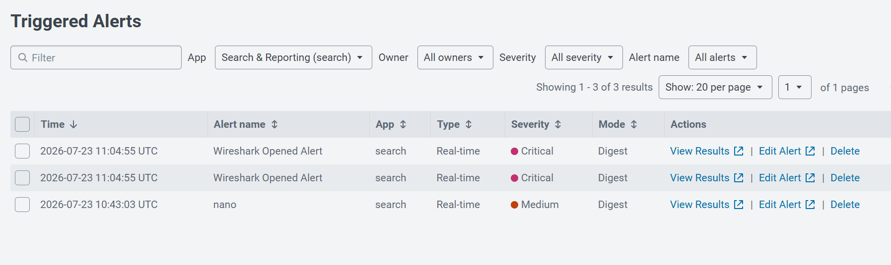

# 🛡️ Hands-on Splunk SIEM Detection Lab (Ubuntu Server)

📌 Project Overview
This project documents the deployment, configuration, and practical use cases of a Splunk Enterprise SIEM environment hosted on an Ubuntu Linux Server. The lab focuses on real-time log ingestion, custom detection rule creation, search optimization using macros, and streamlining analyst investigation flows through workflow actions and data normalization.

🏗️ Lab Architecture & Environment
SIEM Platform: Splunk Enterprise

Host Operating System: Ubuntu Server (22.04 LTS)

Ingested Log Sources: /var/log/auth.log (Linux System & Authentication Logs)

Focus Area: Detection Engineering, Real-Time Alerting, SIEM Knowledge Objects (Macros, Workflow Actions, Field Aliases, Calculated Fields)

🎯 Key Detection Use Cases & Configuration
1. Real-Time Privileged Activity Monitoring
Objective: Detect execution of administrative commands executed via sudo.

SPL Query: index=main source="/var/log/auth.log" "COMMAND="

Alerting: Configured Real-Time Triggered Alerts to capture execution of privileged tools and commands immediately on the Splunk dashboard.

⚡ Knowledge Objects & Optimization
1. 🔍 Search Macros
Created reusable search macros to simplify repetitive query syntax and streamline search workflows across the lab.

Macro Name: sudo_events

Definition: index=main source="/var/log/auth.log" "COMMAND="

Usage: Simplifies investigation queries by typing sudo_events in the search bar.

2. 🔗 Analyst Workflow Actions
Implemented custom Workflow Actions to accelerate Incident Response and Threat Intelligence lookup:

Feature: Enabled direct, one-click pivoting from extracted IP addresses and event fields within log entries directly to external threat intelligence platforms (e.g., VirusTotal / AbuseIPDB / Whois).

Impact: Reduced analyst triage time and manual copy-paste errors during log investigation.

3. 🏷️ Field Aliases & Data Normalization
Created field aliases to normalize field names across different log sources to match CIM standards:

Original Field: src

Aliased Field: source_ip

Sourcetype: access_combined

4. 🧮 Calculated Fields
Created automated field calculations to enhance data readability without using runtime eval commands:

Sourcetype: access_combined

New Field: megs

Expression: bytes/1024/1024 (Converts bytes to Megabytes automatically)

🚀 Key Takeaways & Practical Skills
Configuring log inputs and source types on Linux endpoints.

Writing targeted Search Processing Language (SPL) queries for threat detection.

Creating SIEM Knowledge Objects (Macros, Workflow Actions, Aliases) to improve SOC efficiency.

Validating detection logic through simulated activities in a live environment.

Standardizing data structures for faster querying and better readability.
